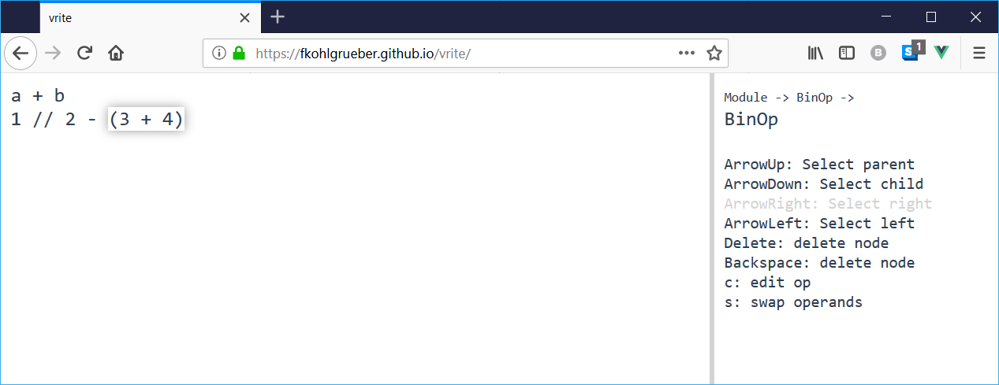

# vrite

> An experimental AST-based structure editor for python

[Try it yourself](https://fkohlgrueber.github.io/vrite/)

This is very early work and a lot of things are going to change.

## Feedback / Questions

Feel free to contact me with anything regarding this project. You can send me an [e-mail](mailto:felix.kohlgrueber@gmail.com) or reach out on twitter [@fkohlgrueber](https://twitter.com/fkohlgrueber).

## Development setup

See [setup.md](setup.md).
